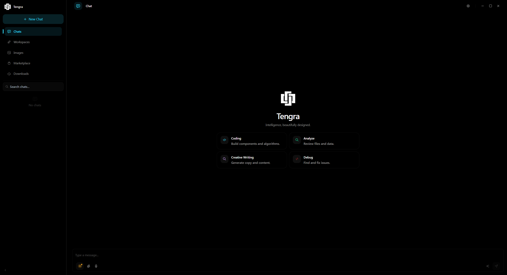
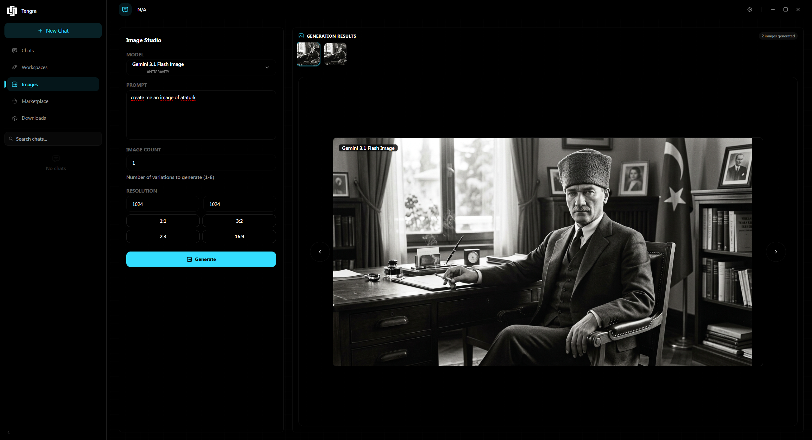
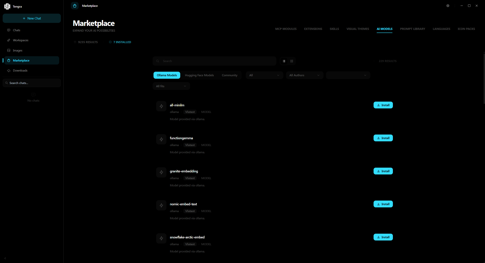
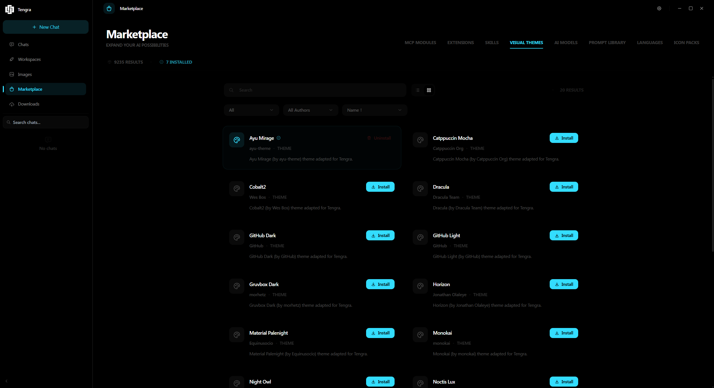
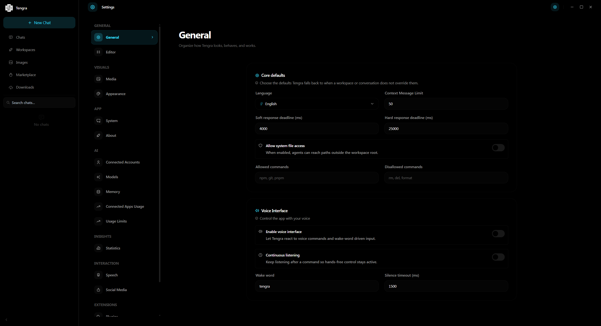

# Tengra

Tengra is a desktop AI assistant for local and remote development workflows. It combines provider accounts, local model tooling, workspaces, terminal access, MCP/plugin expansion, and native sidecar services in one Electron application.

This project is an unofficial client and is not affiliated with GitHub, Microsoft, Google, Anthropic, OpenAI, NVIDIA, or their subsidiaries. Users are responsible for complying with each provider's terms.

## Quick Start

Requirements:

- Node.js 20 or newer
- Rust stable toolchain (required for native sidecar services)

```bash
git clone https://github.com/TengraStudio/tengra.git
cd tengra
npm install
npm run dev
```

Production build:

```bash
npm run build          # Builds everything
npm run build:publish  # Creates installer/package
```

## Screenshots

Captured from the built app:

---
**Home Page** where you can chat with ai!


**Image Studio** where you can generate images!


**Marketplace Models** where you can download models!


**Marketplace Themes** where you can download themes!


**Settings** where you can change settings!


## Documentation

- [Contributing](docs/CONTRIBUTING.md)
- [Architecture](docs/ARCHITECTURE.md)  

## Known Issues


## License

Tengra is licensed under GPL-3.0. See [LICENSE](LICENSE).
