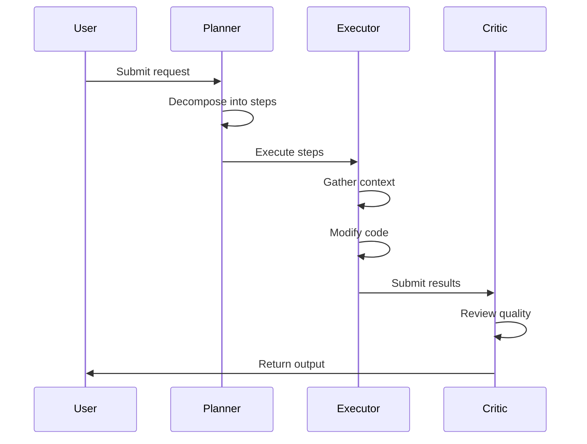

# System Architecture

Tengra is built with a multi-process, polyglot architecture designed to maximize security, performance, and developer flexibility. This document provides a detailed look at how the different components of Tengra interact to provide a seamless AI coding experience.

## Process Model and Communication

Tengra utilizes Electron's multi-process architecture to isolate the user interface from the intensive system-level logic.

### Renderer Process (UI)

The frontend is a React application that runs in a context-isolated environment. It has no direct access to the operating system or the Node.js runtime. This isolation is a critical security measure against remote code execution via malicious AI outputs.

**Key Components:**
- **React 18** with TypeScript
- **Tailwind CSS** for styling
- **Framer Motion** for animations
- **Monaco Editor** for code editing
- **xterm.js** for terminal emulation

### Main Process (Orchestration)

The Main process serves as the central hub. It manages the application's lifecycle, coordinates the service layer, and handles communication with external microservices. All high-level business logic resides here, including the agent council and workspace management.

**Key Responsibilities:**
- Service lifecycle management
- IPC handler registration
- Database initialization
- Proxy process management
- Native microservice coordination

### Inter-Process Communication (IPC)

Communication between the Renderer and Main process occurs over a secure IPC bridge. We use a strictly whitelisted set of methods to ensure that the UI can only perform authorized actions.

**IPC Categories:**
| Category | Prefix | Examples |
|----------|--------|----------|
| Window/System | `window:`, `process:`, `health:` | Window controls, lifecycle events |
| Auth/Security | `auth:`, `key-rotation:`, `audit:` | OAuth, token management |
| AI/LLM | `chat:`, `ollama:`, `llama:`, `memory:` | Chat completions, model management |
| Project | `project:`, `git:`, `terminal:`, `ssh:` | Project operations, version control |
| Data | `db:`, `files:`, `backup:` | Database, filesystem, backup |
| UI | `settings:`, `theme:`, `clipboard:` | User preferences |

## Service Oriented Architecture

The Main process is organized into self-contained services, each responsible for a specific domain. These services are managed through a dependency injection container, which handles their initialization and lifecycle.

### Domain Breakdown

#### Security Domain
Manages encryption, user accounts, and secure credential storage.
- **AuthService**: Multi-provider authentication (GitHub, Copilot)
- **TokenService**: OAuth token lifecycle management
- **SecurityService**: Cryptographic primitives and validation
- **KeyRotationService**: API key rotation
- **RateLimitService**: API rate limiting

#### LLM Domain
Handles AI model interactions and orchestration.
- **LLMService**: Multi-provider LLM integration (OpenAI, Anthropic, Groq, NVIDIA, OpenCode)
- **OllamaService**: Local Ollama model management
- **HuggingFaceService**: HuggingFace model hub integration
- **ModelRegistryService**: Model registration and discovery
- **ModelFallbackService**: Fallback chain for availability
- **EmbeddingService**: Text embedding for semantic search
- **MemoryService**: Conversation memory management
- **AdvancedMemoryService**: Vector-based semantic memory

#### Project Domain
Manages workspace and development tools.
- **ProjectService**: Project management and workspace handling
- **ProjectAgentService**: AI agent for project tasks
- **CodeIntelligenceService**: Code analysis with embeddings
- **GitService**: Git operations
- **SSHService**: SSH connection management
- **DockerService**: Docker container management
- **TerminalService**: Terminal emulation with multiple backends

#### Data Domain
Handles all persistent storage.
- **DatabaseService**: PGlite database management
- **FileSystemService**: Secure file operations
- **BackupService**: Backup and restore
- **ChatEventService**: Chat event persistence

#### Analysis Domain
Metrics and monitoring.
- **TelemetryService**: Usage telemetry
- **PerformanceService**: Performance metrics
- **AuditLogService**: Security audit logging
- **SentryService**: Error reporting

## Native Microservices

To handle tasks that require high performance or low-level networking capabilities, Tengra delegates work to specialized microservices.

### Go Proxy (CLIProxy-Embed)

The Go proxy is the gateway for all external LLM communication. It manages:
- **Request Routing**: Directing outgoing calls to the correct provider endpoint
- **Auth Injection**: Dynamically adding authentication headers
- **Streaming Optimization**: Buffering and forwarding model responses
- **Quota Management**: Provider-specific quota handling

### Rust Token Service

Dedicated to background maintenance of authentication tokens:
- Monitors token expiration
- Executes refresh flows automatically
- Ensures session continuity

## Secure Proxy Routing

Tengra implements a "stateless" approach to credential handling:

1. Tokens stored in encrypted database
2. Decrypted only in memory during requests
3. Sent to Go proxy over localized HTTP interface
4. Secured by system-generated secret key

This design ensures raw credentials never touch disk unencrypted.

## Data Persistence and Memory

### PGlite (PostgreSQL)

Embedded PostgreSQL for relational data:
- User settings
- Chat histories
- Project metadata
- Agent state

### Semantic Memory (Vector Search)

Vector embeddings for long-term agent memory:
- Semantic code search
- Context retrieval
- Knowledge persistence

## Agent Lifecycle

### Agent Types

| Agent | Responsibility |
|-------|----------------|
| **Planner** | Task decomposition, step sequencing |
| **Executor** | Code modification, system actions |
| **Critic** | Quality review, regression prevention |

## Council Execution Architecture (March 1 Scope)

The council system is frozen around six explicit components:

| Component | Responsibility | Explicitly Not Allowed |
|-----------|----------------|------------------------|
| President | Approval gate, stage transitions, reassignment, escalation | Direct stage execution |
| Planner | Stage graph, dependencies, acceptance criteria | Runtime routing or execution |
| Router | Model/account selection + deterministic fallback | Plan approval or execution-state mutation |
| Worker | Stage-bounded execution and blocker reporting | Scope/plan mutation |
| Reviewer | Acceptance validation and fix/escalation verdict | Ownership reassignment |
| Recovery | Crash/restart state restoration from checkpoints | Plan structure edits |

Failure-domain ownership:
- Planning failures: Planner -> President.
- Quota/provider routing failures: Router -> President.
- Stage execution failures: Worker -> Reviewer -> President.
- Validation failures: Reviewer-managed bounded retry, then President escalation.
- Crash/resume failures: Recovery -> President intervention.

Reference ADR: `docs/adr/ADR-2026-03-01-council-execution-model.md`.

## Architecture Patterns

### Dependency Injection Container

Factory-based service creation with lifecycle hooks:
- Singleton scope for services
- Transient scope for utilities
- Automatic cleanup on shutdown

### Circuit Breaker

Resilience pattern for external service calls:
- **CLOSED**: Normal operation
- **OPEN**: Requests blocked, waiting for reset
- **HALF_OPEN**: Testing recovery

### Repository Pattern

Data access abstraction:
- `ChatRepository` - Chat persistence
- `ProjectRepository` - Project data
- `KnowledgeRepository` - Knowledge base
- `SystemRepository` - System data

### Event-Driven Architecture

Loose coupling via EventBus:
- Services emit events without knowing subscribers
- Services subscribe to relevant events
- Used for: `db:ready`, `db:error`, lifecycle events

### Lazy Loading

On-demand service creation:
- Expensive services loaded when needed
- Transparent proxy objects
- Examples: DockerService, SSHService, ScannerService

## Architecture Decisions

Formal decisions are tracked in `docs/adr/`:

- `0001-electron-multi-process-architecture.md` - Process isolation rationale
- `0002-structured-changelog-source-of-truth.md` - Changelog management
- `0003-service-oriented-main-process.md` - Service architecture

## Security Measures

1. **Path Security**: File operations restricted to allowed roots
2. **Command Validation**: Shell commands validated before execution
3. **Prompt Sanitization**: Prevents prompt injection attacks
4. **Sender Validation**: IPC messages validated to come from main window
5. **Certificate Error Blocking**: Prevents MITM attacks
6. **Rate Limiting**: Prevents API abuse
7. **Context Isolation**: Renderer process sandboxed from Node.js

