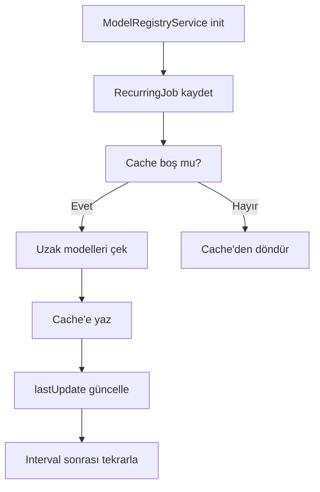

# Services Architecture

Bu dosya, Orbit'in servis katmanının mimarisini ve son güncellemeleri detaylı olarak açıklar.

---

## Servis Organizasyonu

Servisler domain bazlı klasörlere organize edilmiştir:

```
src/main/services/
├── llm/                    # AI Model Servisleri
│   ├── ollama.service.ts
│   ├── copilot.service.ts
│   ├── huggingface.service.ts
│   ├── llama.service.ts
│   ├── model-registry.service.ts    # YENİ
│   ├── multi-model-comparison.service.ts
│   └── context-retrieval.service.ts
│
├── data/                   # Veri Yönetimi
│   ├── database.service.ts
│   ├── data.service.ts
│   ├── chat-event.service.ts
│   └── image-persistence.service.ts
│
├── project/                # Proje Yönetimi
│   ├── project.service.ts
│   ├── git.service.ts
│   ├── docker.service.ts
│   └── terminal.service.ts
│
├── security/               # Güvenlik
│   ├── token.service.ts        # ESKİ: token-refresh.service.ts
│   ├── key-rotation.service.ts
│   └── rate-limit.service.ts
│
├── system/                 # Sistem
│   └── command.service.ts
│
├── proxy/                  # Proxy
│   └── quota.service.ts
│
└── [diğer servisler]       # Henüz kategorize edilmemiş
```

---

## Yeni Servisler

### 1. ModelRegistryService (`llm/model-registry.service.ts`)

Model keşfi ve yönetimi için merkezi servis.

**Özellikler:**
- Ollama ve HuggingFace'den uzak model listesi çekme
- Yerel kurulu modelleri listeleme
- Model verilerini cache'leme
- Periyodik güncelleme (JobScheduler ile)

**Kullanım:**
```typescript
const models = await modelRegistryService.getRemoteModels()
const installed = await modelRegistryService.getInstalledModels()
const lastUpdate = modelRegistryService.getLastUpdate()
```

**Ayarlar:**
```typescript
settings.ai?.modelUpdateInterval // ms, default: 1 saat
```

### 2. TokenService (`security/token.service.ts`)

Unified token yenileme servisi (eski adı: TokenRefreshService).

**Desteklenen Sağlayıcılar:**
- Google/Antigravity (OAuth 2.0 refresh token)
- Codex (OpenAI OAuth)
- Claude (Session cookie + OAuth)
- Copilot (GitHub token → Session token)

**Claude Özel Durumu:**
Claude geleneksel OAuth kullanmaz. Servis:
1. Electron'un cookie jar'ından `sessionKey` yakalar
2. Session key'in geçerliliğini test eder
3. OAuth refresh token varsa standart akışı dener
4. Session süresi dolarsa kullanıcıyı uyarır

**Ayarlar:**
```typescript
settings.ai?.tokenRefreshInterval   // ms, default: 5 dakika
settings.ai?.copilotRefreshInterval // ms, default: 15 dakika
```

### 3. JobSchedulerService (Güncellenmiş)

Kalıcı, yapılandırılabilir zamanlanmış görevler.

**Yeni Özellikler:**
- **Recurring Jobs**: Tekrarlayan görevler
- **Persistent State**: Son çalışma zamanı saklanır (`data/config/jobs.json`)
- **Configurable Intervals**: Ayarlardan dinamik olarak interval okunabilir
- **Smart Scheduling**: Uygulama yeniden başlatıldığında doğru zamanda çalışır

**Örnek:**
```typescript
scheduler.registerRecurringJob(
    'my-job',
    async () => { /* task */ },
    () => settings.ai?.myInterval || 300000
)
await scheduler.start()
```

---

## Dependency Injection

Servisler `src/main/startup/services.ts` dosyasında kaydedilir ve DI container ile yönetilir.

**Kayıt Örneği:**
```typescript
container.register('modelRegistryService', (os, hf, js, ss) => new ModelRegistryService(
    os as OllamaService,
    hf as HuggingFaceService,
    js as JobSchedulerService,
    ss as SettingsService
), ['ollamaService', 'huggingFaceService', 'jobSchedulerService', 'settingsService']);
```

**Çözümleme:**
```typescript
const service = container.resolve<ServiceType>('serviceName')
```

---

## Ayarlar Tipi Güncellemesi

`src/shared/types/settings.ts` dosyasına eklenen AI ayarları:

```typescript
ai?: {
    modelUpdateInterval?: number    // Model cache güncelleme (ms)
    tokenRefreshInterval?: number   // OAuth token yenileme (ms)
    copilotRefreshInterval?: number // Copilot session yenileme (ms)
}
```

**Varsayılan Değerler:**
- `modelUpdateInterval`: 3600000 (1 saat)
- `tokenRefreshInterval`: 300000 (5 dakika)
- `copilotRefreshInterval`: 900000 (15 dakika)

---

## Veri Akışı

### Token Yenileme Akışı

```mermaid
graph TD
    A[App Başlatma] --> B[TokenService.start()]
    B --> C{JobScheduler var mı?}
    C -->|Evet| D[RecurringJob kaydet]
    C -->|Hayır| E[Legacy setInterval]
    D --> F[job state yükle]
    F --> G[Sonraki çalışma zamanı hesapla]
    G --> H[setTimeout ile planla]
    H --> I[Token yenile]
    I --> J[State güncelle]
    J --> G
```

### Model Güncelleme Akışı



---

## En İyi Pratikler

1. **Servisler singleton olmalı** - Container her servisten tek instance oluşturur
2. **Circular dependency'den kaçının** - Gerekirse lazy injection kullanın
3. **appLogger kullanın** - `console.log` yerine
4. **Error handling zorunlu** - Her async operasyon try-catch içinde
5. **TypeScript strict mode** - `any` kullanmayın
