# Tengra Data Model

> PGlite database schema documentation. Auto-generated from source code.

## ER Diagram (Mermaid)

```mermaid
erDiagram
    chats ||--o{ messages : "has"
    chats }o--o| folders : "belongs to"
    chats }o--o| projects : "belongs to"
    chats ||--o{ token_usage : "tracks"

    uac_tasks ||--o{ uac_steps : "has"
    uac_tasks ||--o{ uac_logs : "has"
    uac_tasks ||--o{ uac_checkpoints : "has"
    uac_tasks ||--o{ uac_plan_versions : "has"
    uac_tasks ||--o{ uac_performance_metrics : "has"
    uac_tasks ||--o{ uac_collaboration_messages : "has"
    uac_tasks ||--o{ uac_council_plans : "has"
    uac_tasks ||--o{ uac_council_plan_stages : "has"
    uac_tasks ||--o{ uac_council_assignments : "has"
    uac_tasks ||--o{ uac_council_decisions : "has"
    uac_tasks ||--o{ uac_council_interrupts : "has"

    uac_council_plans ||--o{ uac_council_plan_stages : "contains"
    uac_canvas_nodes ||--o{ uac_canvas_edges : "source/target"

    agent_tasks ||--o{ agent_messages : "has"
    agent_tasks ||--o{ agent_tool_executions : "has"
    agent_tasks ||--o{ agent_events : "has"
    agent_tasks ||--o{ agent_provider_history : "has"
    agent_tasks ||--o{ agent_errors : "has"
    agent_tasks ||--o{ agent_checkpoints : "has"

    chats { TEXT id PK }
    chats { TEXT title }
    chats { INTEGER is_Generating }
    chats { TEXT backend }
    chats { TEXT model }
    chats { TEXT folder_id FK }
    chats { TEXT project_id FK }
    chats { INTEGER is_pinned }
    chats { INTEGER is_favorite }
    chats { TEXT metadata }
    chats { BIGINT created_at }
    chats { BIGINT updated_at }

    messages { TEXT id PK }
    messages { TEXT chat_id FK }
    messages { TEXT role }
    messages { TEXT content }
    messages { BIGINT timestamp }
    messages { TEXT provider }
    messages { TEXT model }
    messages { TEXT metadata }
    messages { TEXT vector }

    folders { TEXT id PK }
    folders { TEXT name }
    folders { TEXT color }
    folders { BIGINT created_at }
    folders { BIGINT updated_at }

    projects { TEXT id PK }
    projects { TEXT title }
    projects { TEXT description }
    projects { TEXT path }
    projects { TEXT mounts }
    projects { TEXT chat_ids }
    projects { TEXT council_config }
    projects { TEXT status }
    projects { TEXT metadata }
    projects { BIGINT created_at }
    projects { BIGINT updated_at }

    token_usage { TEXT id PK }
    token_usage { TEXT chat_id FK }
    token_usage { TEXT project_path }
    token_usage { TEXT message_id }
    token_usage { TEXT provider }
    token_usage { TEXT model }
    token_usage { INTEGER tokens_sent }
    token_usage { INTEGER tokens_received }
    token_usage { REAL cost_estimate }
    token_usage { BIGINT timestamp }

    prompts { TEXT id PK }
    prompts { TEXT title }
    prompts { TEXT content }
    prompts { TEXT tags }
    prompts { BIGINT created_at }
    prompts { BIGINT updated_at }

    linked_accounts { TEXT id PK }
    linked_accounts { TEXT provider }
    linked_accounts { TEXT email }
    linked_accounts { TEXT display_name }
    linked_accounts { TEXT avatar_url }
    linked_accounts { TEXT access_token }
    linked_accounts { TEXT refresh_token }
    linked_accounts { TEXT session_token }
    linked_accounts { BIGINT expires_at }
    linked_accounts { TEXT scope }
    linked_accounts { INTEGER is_active }
    linked_accounts { TEXT metadata }
    linked_accounts { BIGINT created_at }
    linked_accounts { BIGINT updated_at }

    app_settings { TEXT key PK }
    app_settings { TEXT value }
    app_settings { TEXT category }
    app_settings { INTEGER updated_at }

    audit_logs { TEXT id PK }
    audit_logs { BIGINT timestamp }
    audit_logs { TEXT action }
    audit_logs { TEXT category }
    audit_logs { TEXT user_id }
    audit_logs { TEXT details }
    audit_logs { INTEGER success }

    usage_tracking { TEXT id PK }
    usage_tracking { BIGINT timestamp }
    usage_tracking { TEXT provider }
    usage_tracking { TEXT model }

    migration_history { INTEGER version PK }
    migration_history { TEXT name }
    migration_history { TEXT checksum }
    migration_history { BIGINT applied_at }
    migration_history { BIGINT rolled_back_at }

    file_diffs { TEXT id PK }
    file_diffs { TEXT project_path }
    file_diffs { TEXT file_path }
    file_diffs { TEXT diff }
    file_diffs { BIGINT created_at }
    file_diffs { TEXT session_id }
    file_diffs { TEXT system_id }

    agent_archives { TEXT id PK }
    agent_archives { TEXT original_id }
    agent_archives { TEXT payload }
    agent_archives { INTEGER deleted_at }
```

## Table Groups

### Core Chat System
| Table | Source | Description |
|-------|--------|-------------|
| `chats` | `chat.repository.ts` | Chat sessions |
| `messages` | `chat.repository.ts` | Chat messages with optional vector embeddings |
| `folders` | `system.repository.ts` | Chat folder organization |
| `projects` | `project.repository.ts` | Project definitions with mount configs |

### Analytics & Tracking
| Table | Source | Description |
|-------|--------|-------------|
| `token_usage` | `system.repository.ts` | Per-message token consumption |
| `usage_tracking` | `system.repository.ts` | Provider/model usage events |
| `audit_logs` | `system.repository.ts` | Security and operational audit trail |

### UAC (Unified Agent Canvas)
| Table | Source | Description |
|-------|--------|-------------|
| `uac_tasks` | `uac.repository.ts` | Agent task definitions |
| `uac_steps` | `uac.repository.ts` | Task step breakdown (FK → uac_tasks) |
| `uac_logs` | `uac.repository.ts` | Agent execution logs (FK → uac_tasks) |
| `uac_checkpoints` | `uac.repository.ts` | State snapshots (FK → uac_tasks) |
| `uac_plan_versions` | `uac.repository.ts` | Plan revision history (FK → uac_tasks) |
| `uac_canvas_nodes` | `uac.repository.ts` | Visual canvas node positions |
| `uac_canvas_edges` | `uac.repository.ts` | Canvas node connections (FK → uac_canvas_nodes) |
| `uac_plan_patterns` | `uac.repository.ts` | Learned planning patterns |
| `uac_performance_metrics` | `uac.repository.ts` | Agent performance data (FK → uac_tasks) |
| `uac_collaboration_messages` | `uac.repository.ts` | Inter-agent messages (FK → uac_tasks) |
| `uac_council_plans` | `uac.repository.ts` | Multi-agent council plans (FK → uac_tasks) |
| `uac_council_plan_stages` | `uac.repository.ts` | Council plan stages (FK → uac_council_plans, uac_tasks) |
| `uac_council_assignments` | `uac.repository.ts` | Agent-to-stage assignments (FK → uac_tasks) |
| `uac_council_decisions` | `uac.repository.ts` | Council decision log (FK → uac_tasks) |
| `uac_council_interrupts` | `uac.repository.ts` | Council interrupt events (FK → uac_tasks) |

### Agent Persistence
| Table | Source | Description |
|-------|--------|-------------|
| `agent_tasks` | `agent-persistence.service.ts` | Agent task state and metrics |
| `agent_messages` | `agent-persistence.service.ts` | Agent conversation history (FK → agent_tasks) |
| `agent_tool_executions` | `agent-persistence.service.ts` | Tool call records (FK → agent_tasks) |
| `agent_events` | `agent-persistence.service.ts` | State transition events (FK → agent_tasks) |
| `agent_provider_history` | `agent-persistence.service.ts` | LLM provider fallback log (FK → agent_tasks) |
| `agent_errors` | `agent-persistence.service.ts` | Error tracking (FK → agent_tasks) |
| `agent_checkpoints` | `agent-persistence.service.ts` | Execution checkpoints (FK → agent_tasks) |
| `agent_archives` | `agent.service.ts` | Soft-deleted agent data |

### System
| Table | Source | Description |
|-------|--------|-------------|
| `app_settings` | `settings.repository.ts` | Key-value app configuration |
| `linked_accounts` | `system.repository.ts` | OAuth provider accounts |
| `prompts` | `system.repository.ts` | Saved prompt templates |
| `migration_history` | `database.service.ts` | Schema migration tracking |
| `file_diffs` | `knowledge.repository.ts` | File change tracking for memory |

## Indexes

### Core
- `idx_messages_chat_id` — messages(chat_id)
- `idx_messages_chat_time` — messages(chat_id, timestamp ASC)
- `idx_messages_timestamp` — messages(timestamp DESC)
- `idx_chats_updated_at` — chats(updated_at DESC)
- `idx_chats_project_id` — chats(project_id)
- `idx_chats_folder_id` — chats(folder_id)
- `idx_prompts_created_at` — prompts(created_at DESC)
- `idx_linked_accounts_provider_active` — linked_accounts(provider, is_active)

### Token & Usage
- `idx_token_usage_timestamp` — token_usage(timestamp DESC)
- `idx_token_usage_provider_model_time` — token_usage(provider, model, timestamp DESC)
- `idx_token_usage_project_time` — token_usage(project_path, timestamp DESC)
- `idx_usage_tracking_timestamp` — usage_tracking(timestamp DESC)
- `idx_usage_tracking_provider_model` — usage_tracking(provider, model)
- `idx_audit_logs_timestamp` — audit_logs(timestamp DESC)
- `idx_audit_logs_category_timestamp` — audit_logs(category, timestamp DESC)

### File Diffs
- `idx_file_diffs_file_path` — file_diffs(file_path)
- `idx_file_diffs_created_at` — file_diffs(created_at DESC)
- `idx_file_diffs_session` — file_diffs(session_id)

### UAC
- `idx_uac_tasks_project_status` — uac_tasks(project_path, status, updated_at DESC)
- `idx_uac_tasks_node_id` — uac_tasks(node_id)
- `idx_uac_steps_task_index` — uac_steps(task_id, index_num)
- `idx_uac_logs_task_created` — uac_logs(task_id, created_at ASC)
- `idx_uac_checkpoints_task_created` — uac_checkpoints(task_id, created_at DESC)
- `idx_uac_checkpoints_task_step` — uac_checkpoints(task_id, step_index DESC)
- `idx_uac_plan_versions_task_version` — uac_plan_versions(task_id, version_number DESC)
- `idx_uac_plan_patterns_keywords` — uac_plan_patterns(task_keywords)
- `idx_uac_canvas_nodes_updated` — uac_canvas_nodes(updated_at DESC)
- `idx_uac_canvas_edges_source_target` — uac_canvas_edges(source, target)
- `idx_uac_performance_metrics_task_created` — uac_performance_metrics(task_id, created_at DESC)
- `idx_uac_collab_messages_task_created` — uac_collaboration_messages(task_id, created_at ASC)
- `idx_uac_collab_messages_task_stage` — uac_collaboration_messages(task_id, stage_id, created_at ASC)
- `idx_uac_council_plans_task_updated` — uac_council_plans(task_id, updated_at DESC)
- `idx_uac_council_stages_task_stage` — uac_council_plan_stages(task_id, stage_id, status, updated_at DESC)
- `idx_uac_council_assignments_task_stage` — uac_council_assignments(task_id, stage_id, assigned_at DESC)
- `idx_uac_council_decisions_task_created` — uac_council_decisions(task_id, stage_id, created_at DESC)
- `idx_uac_council_interrupts_task_created` — uac_council_interrupts(task_id, stage_id, created_at DESC)

### Agent Persistence
- `idx_agent_checkpoints_task` — agent_checkpoints(task_id, step_index)
