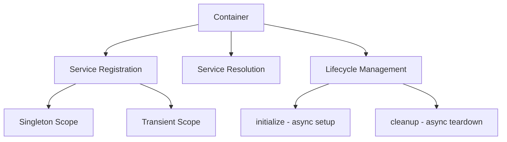
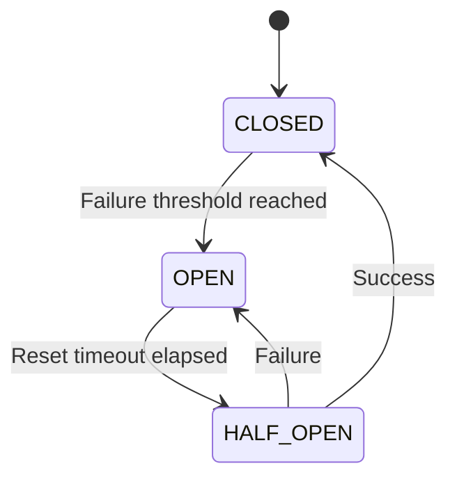
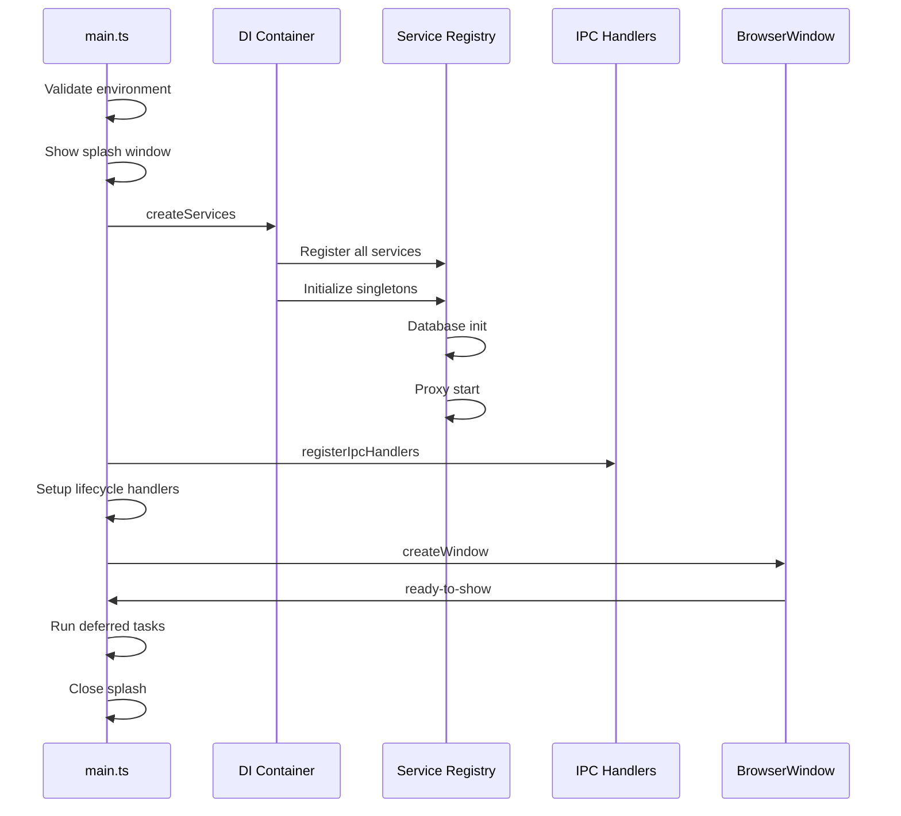

# Comprehensive Analysis of `src/main` Folder

## Overview

The `src/main` folder contains the Electron main process code for the Tengra application. This is a sophisticated AI-powered development assistant with multi-provider LLM support, project management, terminal integration, and extensibility via MCP (Model Context Protocol) plugins.

---

## 1. Services and Their Purposes

### 1.1 Core Infrastructure Services

| Service | File | Purpose |
|---------|------|---------|
| **Container** | [`core/container.ts`](src/main/core/container.ts) | Lightweight Dependency Injection container managing service registration, resolution, and lifecycle |
| **ServiceRegistry** | [`core/service-registry.ts`](src/main/core/service-registry.ts) | Dynamic service registry with metadata support, enables plugin architectures and service discovery |
| **CircuitBreaker** | [`core/circuit-breaker.ts`](src/main/core/circuit-breaker.ts) | Resilience pattern implementation for handling service failures gracefully |

### 1.2 System Services

| Service | Purpose |
|---------|---------|
| **SettingsService** | Manages application settings with persistence |
| **ConfigService** | Configuration management built on settings |
| **EventBusService** | Pub/sub event system for inter-service communication |
| **CommandService** | Shell command execution with safety validation |
| **SystemService** | System-level operations and information |
| **NetworkService** | Network diagnostics and connectivity checks |
| **ProcessService** | Child process management |
| **ProcessManagerService** | Centralized process lifecycle management |
| **JobSchedulerService** | Scheduled task execution |
| **HealthCheckService** | Application health monitoring |
| **UpdateService** | Application update management |

### 1.3 Data Services

| Service | Purpose |
|---------|---------|
| **DataService** | Core data path management and application data directories |
| **DatabaseService** | Remote database operations with query analytics, slow query detection, and migration support |
| **DatabaseClientService** | Low-level database client connection management |
| **FileSystemService** | File operations with security boundaries (allowed roots) |
| **FileManagementService** | High-level file management operations |
| **FileChangeTracker** | Tracks file changes for synchronization |
| **ChatEventService** | Chat event persistence and retrieval |
| **ImagePersistenceService** | Image storage and retrieval |
| **BackupService** | Backup and restore functionality |

### 1.4 LLM Services

| Service | Purpose |
|---------|---------|
| **LLMService** | Multi-provider LLM integration (OpenAI, Anthropic, Groq, NVIDIA, OpenCode) with circuit breakers |
| **OllamaService** | Local Ollama model management |
| **OllamaHealthService** | Ollama health monitoring |
| **LlamaService** | Local LLaMA model integration |
| **HuggingFaceService** | HuggingFace model hub integration |
| **LocalAIService** | Local AI inference coordination |
| **LocalImageService** | Local image generation |
| **EmbeddingService** | Text embedding generation for semantic search |
| **MemoryService** | Conversation memory management |
| **AdvancedMemoryService** | Vector-based semantic memory with embeddings |
| **BrainService** | AI reasoning and context management |
| **AgentService** | AI agent orchestration |
| **ContextRetrievalService** | Context-aware information retrieval |
| **ModelRegistryService** | Model registration and discovery |
| **ModelDownloaderService** | Model downloading from various sources |
| **ModelFallbackService** | Fallback chain for model availability |
| **ResponseCacheService** | LLM response caching |
| **PromptTemplatesService** | Prompt template management |
| **CopilotService** | GitHub Copilot integration |
| **IdeaGeneratorService** | AI-powered idea generation |
| **MarketplaceService** | Model marketplace integration |
| **ModelCollaborationService** | Multi-model collaboration |
| **MultiModelComparisonService** | Compare outputs from multiple models |

### 1.5 Project Services

| Service | Purpose |
|---------|---------|
| **ProjectService** | Project management and workspace handling |
| **ProjectAgentService** | AI agent for project tasks with checkpointing and execution |
| **ProjectScaffoldService** | Project scaffolding and templating |
| **CodeIntelligenceService** | Code analysis and symbol search with embeddings |
| **GitService** | Git operations and version control |
| **SSHService** | SSH connection management for remote development |
| **DockerService** | Docker container management |
| **TerminalService** | Terminal emulation with multiple backends (local, SSH, Docker) |
| **TerminalProfileService** | Terminal profile management |
| **TerminalSmartService** | AI-enhanced terminal with command suggestions |
| **MultiAgentOrchestratorService** | Multi-agent task orchestration |

### 1.6 Agent Services (Sub-module)

| Service | Purpose |
|---------|---------|
| **AgentRegistryService** | Agent registration and discovery |
| **AgentPersistenceService** | Agent state persistence |
| **AgentCheckpointService** | Agent execution checkpoints for rollback |
| **AgentCollaborationService** | Inter-agent communication |
| **AgentTemplateService** | Agent templates and presets |
| **AgentPerformanceService** | Agent performance metrics |
| **AgentTaskExecutor** | Individual task execution engine |

### 1.7 Security Services

| Service | Purpose |
|---------|---------|
| **AuthService** | Authentication with multiple providers (GitHub, Copilot) |
| **AuthAPIService** | Authentication API endpoints |
| **TokenService** | Token management and refresh |
| **SecurityService** | Security utilities and validation |
| **KeyRotationService** | API key rotation management |
| **RateLimitService** | Rate limiting for API calls |

### 1.8 Proxy Services

| Service | Purpose |
|---------|---------|
| **ProxyService** | Embedded proxy server for API routing |
| **ProxyProcessManager** | Proxy process lifecycle |
| **QuotaService** | API quota management with provider-specific handlers |

### 1.9 Analysis Services

| Service | Purpose |
|---------|---------|
| **MonitoringService** | System monitoring |
| **PerformanceService** | Performance metrics collection |
| **PageSpeedService** | Web performance analysis |
| **ScannerService** | Code scanning and analysis |
| **SentryService** | Error reporting to Sentry |
| **TelemetryService** | Usage telemetry |
| **UsageTrackingService** | Feature usage tracking |
| **TimeTrackingService** | Time spent tracking |
| **AuditLogService** | Audit logging for security events |
| **MetricsService** | Application metrics |

### 1.10 External Services

| Service | Purpose |
|---------|---------|
| **WebService** | Web scraping and search (Tavily integration) |
| **HttpService** | HTTP client wrapper |
| **ContentService** | Content fetching and processing |
| **UtilityService** | Miscellaneous utility functions |
| **LogoService** | Logo generation for projects |
| **MarketResearchService** | Market research integration |
| **RuleService** | Rule engine for automation |
| **FeatureFlagService** | Feature flag management |
| **CollaborationService** | Real-time collaboration |

### 1.11 UI Services

| Service | Purpose |
|---------|---------|
| **ThemeService** | Theme management (dark/light) |
| **ClipboardService** | Clipboard operations |
| **NotificationService** | Desktop notifications |
| **ScreenshotService** | Screenshot capture |

### 1.12 MCP Services

| Service | Purpose |
|---------|---------|
| **McpPluginService** | MCP plugin lifecycle management |
| **McpMarketplaceService** | MCP plugin marketplace |

### 1.13 Workflow Services

| Service | Purpose |
|---------|---------|
| **WorkflowService** | Workflow automation engine |
| **WorkflowRunner** | Workflow execution |

### 1.14 Other Services

| Service | Purpose |
|---------|---------|
| **ExportService** | Data export functionality |
| **ApiServerService** | Local API server (port 42069) for external integrations |

---

## 2. IPC Handlers

The application uses a comprehensive IPC (Inter-Process Communication) system for renderer-to-main process communication.

### 2.1 IPC Handler Categories

#### Window & System
- [`window.ts`](src/main/ipc/window.ts) - Window controls, minimize, maximize, close, always-on-top
- [`process.ts`](src/main/ipc/process.ts) - Process lifecycle events
- [`health.ts`](src/main/ipc/health.ts) - Health check endpoints
- [`migration.ts`](src/main/ipc/migration.ts) - Database migrations
- [`dialog.ts`](src/main/ipc/dialog.ts) - Native dialog interactions
- [`screenshot.ts`](src/main/ipc/screenshot.ts) - Screenshot functionality
- [`logging.ts`](src/main/ipc/logging.ts) - Log management

#### Authentication & Security
- [`auth.ts`](src/main/ipc/auth.ts) - GitHub/Copilot OAuth flow, account linking
- [`key-rotation.ts`](src/main/ipc/key-rotation.ts) - API key rotation
- [`audit.ts`](src/main/ipc/audit.ts) - Audit log access

#### AI & LLM
- [`chat.ts`](src/main/ipc/chat.ts) - Chat completions with streaming, message handling
- [`ollama.ts`](src/main/ipc/ollama.ts) - Ollama model management
- [`llama.ts`](src/main/ipc/llama.ts) - LLaMA integration
- [`huggingface.ts`](src/main/ipc/huggingface.ts) - HuggingFace model hub
- [`memory.ts`](src/main/ipc/memory.ts) - Memory management
- [`advanced-memory.ts`](src/main/ipc/advanced-memory.ts) - Semantic memory
- [`brain.ts`](src/main/ipc/brain.ts) - AI reasoning
- [`agent.ts`](src/main/ipc/agent.ts) - Agent management
- [`multi-model.ts`](src/main/ipc/multi-model.ts) - Multi-model comparison
- [`collaboration.ts`](src/main/ipc/collaboration.ts) - Model collaboration
- [`model-registry.ts`](src/main/ipc/model-registry.ts) - Model registry
- [`model-downloader.ts`](src/main/ipc/model-downloader.ts) - Model downloading
- [`prompt-templates.ts`](src/main/ipc/prompt-templates.ts) - Prompt templates
- [`token-estimation.ts`](src/main/ipc/token-estimation.ts) - Token counting
- [`marketplace.ts`](src/main/ipc/marketplace.ts) - Model marketplace

#### Project & Development
- [`project.ts`](src/main/ipc/project.ts) - Project management
- [`project-agent.ts`](src/main/ipc/project-agent.ts) - Project AI agent
- [`git.ts`](src/main/ipc/git.ts) - Git operations
- [`git-advanced.ts`](src/main/ipc/git-advanced.ts) - Advanced Git features
- [`terminal.ts`](src/main/ipc/terminal.ts) - Terminal management
- [`ssh.ts`](src/main/ipc/ssh.ts) - SSH connections
- [`code-intelligence.ts`](src/main/ipc/code-intelligence.ts) - Code analysis
- [`idea-generator.ts`](src/main/ipc/idea-generator.ts) - Idea generation

#### Data & Files
- [`db.ts`](src/main/ipc/db.ts) - Database operations
- [`files.ts`](src/main/ipc/files.ts) - File system operations
- [`file-diff.ts`](src/main/ipc/file-diff.ts) - File diff operations
- [`gallery.ts`](src/main/ipc/gallery.ts) - Image gallery
- [`backup.ts`](src/main/ipc/backup.ts) - Backup/restore
- [`export.ts`](src/main/ipc/export.ts) - Data export

#### Proxy & API
- [`proxy.ts`](src/main/ipc/proxy.ts) - Proxy management
- [`proxy-embed.ts`](src/main/ipc/proxy-embed.ts) - Embedded proxy
- [`usage.ts`](src/main/ipc/usage.ts) - Usage tracking

#### MCP Integration
- [`mcp.ts`](src/main/ipc/mcp.ts) - MCP dispatcher
- [`mcp-marketplace.ts`](src/main/ipc/mcp-marketplace.ts) - MCP marketplace

#### UI & Settings
- [`settings.ts`](src/main/ipc/settings.ts) - Settings management
- [`theme.ts`](src/main/ipc/theme.ts) - Theme switching
- [`clipboard.ts`](src/main/ipc/clipboard.ts) - Clipboard operations

#### Tools & Automation
- [`tools.ts`](src/main/ipc/tools.ts) - Tool execution
- [`workflow.ts`](src/main/ipc/workflow.ts) - Workflow automation
- [`orchestrator.ts`](src/main/ipc/orchestrator.ts) - Multi-agent orchestration

#### Performance & Monitoring
- [`performance.ts`](src/main/ipc/performance.ts) - Performance metrics
- [`metrics.ts`](src/main/ipc/metrics.ts) - Application metrics

### 2.2 IPC Wrapper Utilities

The IPC system uses standardized wrappers for consistent error handling:

- **createIpcHandler** - Basic handler with error logging
- **createSafeIpcHandler** - Returns default value on error (never throws)
- **createValidatedIpcHandler** - Zod schema validation for request/response

---

## 3. Utilities

### 3.1 Core Utilities

| Utility | File | Purpose |
|---------|------|---------|
| **Cache** | [`cache.util.ts`](src/main/utils/cache.util.ts) | LRU cache with TTL, eviction callbacks, and memoization |
| **EventBus** | [`event-bus.util.ts`](src/main/utils/event-bus.util.ts) | Event broadcasting utility |
| **IpcWrapper** | [`ipc-wrapper.util.ts`](src/main/utils/ipc-wrapper.util.ts) | IPC handler standardization |
| **IpcBatch** | [`ipc-batch.util.ts`](src/main/utils/ipc-batch.util.ts) | Batch IPC operations |

### 3.2 Validation Utilities

| Utility | Purpose |
|---------|---------|
| **env-validator.util.ts** | Environment variable validation |
| **config-validator.util.ts** | Configuration validation |
| **command-validator.util.ts** | Shell command safety validation |
| **path-security.util.ts** | Path traversal prevention |
| **prompt-sanitizer.util.ts** | Prompt injection prevention |

### 3.3 LLM Utilities

| Utility | Purpose |
|---------|---------|
| **message-normalizer.util.ts** | Message format conversion between LLM providers |
| **model-router.util.ts** | Model routing logic |
| **stream-parser.util.ts** | LLM response stream parsing |
| **response-parser.util.ts** | Response parsing utilities |

### 3.4 Other Utilities

| Utility | Purpose |
|---------|---------|
| **local-auth-server.util.ts** | Local OAuth server for authentication |
| **fetch-interceptor.util.ts** | Fetch API interception |
| **tool-definitions.ts** | Tool definition schemas |
| **tool-executor.ts** | Tool execution engine |

---

## 4. Architecture Patterns Used

### 4.1 Dependency Injection (DI) Container

The application uses a custom lightweight DI container ([`container.ts`](src/main/core/container.ts)):



**Features:**
- Factory-based service creation
- Dependency resolution via named services
- Lifecycle hooks (`initialize()`, `cleanup()`)
- Singleton and transient scopes
- 2-second timeout for cleanup operations

### 4.2 Service-Oriented Architecture (SOA)

Services are organized by domain:
- `services/system/` - System-level services
- `services/llm/` - LLM provider services
- `services/project/` - Project management services
- `services/security/` - Security services
- `services/data/` - Data persistence services
- `services/analysis/` - Analytics services

### 4.3 Circuit Breaker Pattern

Implemented in [`circuit-breaker.ts`](src/main/core/circuit-breaker.ts) for resilience:



**States:**
- **CLOSED** - Normal operation
- **OPEN** - Requests blocked, waiting for reset
- **HALF_OPEN** - Testing if service recovered

### 4.4 Repository Pattern

Data access uses repositories:
- `ChatRepository` - Chat persistence
- `ProjectRepository` - Project data
- `KnowledgeRepository` - Knowledge base
- `SystemRepository` - System data
- `UacRepository` - User account data

Interface defined in [`repository.interface.ts`](src/main/core/repository.interface.ts):
- `findAll()`, `findById()`, `create()`, `update()`, `delete()`
- Pagination support

### 4.5 Event-Driven Architecture

`EventBusService` enables loose coupling:
- Services emit events without knowing subscribers
- Services subscribe to events they care about
- Used for: `db:ready`, `db:error`, IPC lifecycle events

### 4.6 Lazy Loading Pattern

Services that are expensive or conditionally needed are lazy-loaded:
- `lazyServiceRegistry` for on-demand service creation
- `createLazyServiceProxy` for transparent proxy objects
- Examples: `DockerService`, `SSHService`, `ScannerService`, `PageSpeedService`

### 4.7 Strategy Pattern

Used for:
- **QuotaService** - Provider-specific quota handlers (Claude, Copilot, Codex, Antigravity)
- **TerminalService** - Multiple backends (Local, SSH, Docker)

### 4.8 Template Method Pattern

- **BaseService** - Abstract base with logging helpers
- **MCP Plugin Base** - Plugin development template

### 4.9 Observer Pattern

- **ServiceRegistry** emits `service:registered`, `service:unregistered` events
- **EventBusService** for pub/sub messaging

### 4.10 Facade Pattern

- **McpDispatcher** - Facade over McpPluginService for backward compatibility
- **LLMService** - Unified interface over multiple LLM providers

---

## 5. Key Dependencies

### 5.1 Core Dependencies

| Package | Purpose |
|---------|---------|
| **electron** | Desktop application framework |
| **uuid** | Unique identifier generation |
| **dotenv** | Environment variable loading |
| **zod** | Schema validation |

### 5.2 LLM Provider Integration

| Provider | Integration Method |
|----------|-------------------|
| OpenAI | Direct API via HttpService |
| Anthropic | Direct API via HttpService |
| Groq | OpenAI-compatible API |
| NVIDIA NIM | OpenAI-compatible API |
| OpenCode | OpenAI-compatible API |
| Ollama | Local server (localhost:11434) |
| HuggingFace | API integration |
| GitHub Copilot | OAuth + proxy |

### 5.3 External Services

| Service | Purpose |
|---------|---------|
| Tavily | Web search API |
| Sentry | Error reporting |

### 5.4 Database

- Remote database client with connection pooling
- Query analytics and slow query detection
- Migration infrastructure

### 5.5 MCP (Model Context Protocol)

Plugin system for extending AI capabilities:
- Filesystem operations
- Git operations
- Web search
- Terminal commands
- Database administration
- CI/CD integration
- Cloud storage

---

## 6. Application Startup Flow



---

## 7. Security Measures

1. **Path Security** - File operations restricted to allowed roots
2. **Command Validation** - Shell commands validated before execution
3. **Prompt Sanitization** - Prevents prompt injection attacks
4. **Sender Validation** - IPC messages validated to come from main window
5. **Certificate Error Blocking** - Prevents MITM attacks
6. **Rate Limiting** - Prevents API abuse
7. **Audit Logging** - Security events logged

---

## 8. File Structure Summary

```
src/main/
|-- main.ts                    # Application entry point
|-- preload.ts                 # Preload script (IPC bridge)
|-- api/
|   |-- api-server.service.ts  # Local API server
|-- core/
|   |-- container.ts           # DI container
|   |-- service-registry.ts    # Service registry
|   |-- circuit-breaker.ts     # Resilience pattern
|   |-- repository.interface.ts # Repository interface
|-- ipc/                       # IPC handlers (50+ files)
|-- logging/
|   |-- logger.ts              # Application logger
|-- mcp/                       # MCP plugin system
|   |-- dispatcher.ts          # MCP facade
|   |-- servers/               # Built-in MCP servers
|-- preload/
|   |-- domains/               # Domain-specific preload
|-- repositories/
|   |-- *.repository.ts        # Data repositories
|-- services/                  # Business logic services
|   |-- analysis/              # Analytics services
|   |-- data/                  # Data services
|   |-- external/              # External integrations
|   |-- llm/                   # LLM services
|   |-- mcp/                   # MCP services
|   |-- performance/           # Performance monitoring
|   |-- project/               # Project management
|   |-- prompts/               # Prompt management
|   |-- proxy/                 # Proxy services
|   |-- security/              # Security services
|   |-- system/                # System services
|   |-- terminal/              # Terminal backends
|   |-- theme/                 # Theme services
|   |-- ui/                    # UI services
|   |-- workflow/              # Workflow automation
|-- startup/
|   |-- ipc.ts                 # IPC registration
|   |-- lifecycle.ts           # App lifecycle
|   |-- services.ts            # Service creation
|   |-- splash.ts              # Splash screen
|   |-- window.ts              # Window management
|-- tools/
|   |-- tool-definitions.ts    # Tool schemas
|   |-- tool-executor.ts       # Tool execution
|-- types/
|   |-- llm.types.ts           # LLM types
|   |-- mcp.ts                 # MCP types
|   |-- services.ts            # Service types
|-- utils/                     # Utility functions
```

---

## 9. Summary

The `src/main` folder implements a sophisticated Electron main process with:

- **90+ services** organized by domain
- **50+ IPC handlers** for renderer communication
- **15+ utilities** for common operations
- **Multiple architecture patterns** (DI, Circuit Breaker, Repository, Event-Driven)
- **Multi-provider LLM support** (OpenAI, Anthropic, Groq, NVIDIA, Ollama, HuggingFace)
- **MCP plugin system** for extensibility
- **Comprehensive security measures**
- **Lazy loading** for performance optimization

The codebase follows SOLID principles with clear separation of concerns, dependency injection, and service-oriented architecture.
