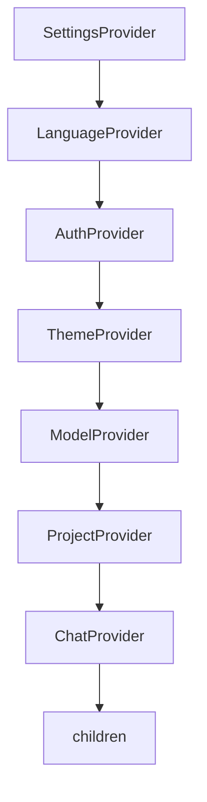

# src/renderer Analysis - Comprehensive Summary

This document provides a detailed analysis of the renderer process architecture in the Tengra application.

---

## Table of Contents

1. [Entry Points](#1-entry-points)
2. [Context Providers](#2-context-providers)
3. [State Management (Stores)](#3-state-management-stores)
4. [Views and View Management](#4-views-and-view-management)
5. [Components](#5-components)
6. [Features Directory](#6-features-directory)
7. [i18n Setup](#7-i18n-setup)
8. [Theme System](#8-theme-system)
9. [Hooks](#9-hooks)
10. [Utilities and Libraries](#10-utilities-and-libraries)
11. [Architecture Patterns](#11-architecture-patterns)

---

## 1. Entry Points

### [`main.tsx`](src/renderer/main.tsx)

The primary entry point for the renderer process:

```typescript
import App from '@renderer/App';
import { AppProviders } from '@renderer/context/AppProviders';
import { installRendererLogger } from '@renderer/logging';
import '@renderer/index.css';
import '@renderer/web-bridge';

installRendererLogger();
ReactDOM.createRoot(rootElement).render(
    <React.StrictMode>
        <AppProviders>
            <App />
        </AppProviders>
    </React.StrictMode>
);
```

**Key responsibilities:**
- Installs renderer logger for consistent logging
- Wraps app with `AppProviders` for context injection
- Uses React StrictMode for development checks

### [`App.tsx`](src/renderer/App.tsx)

Main application component (~465 lines):

**Key features:**
- **Detached Terminal Support**: Checks for `detachedTerminal` URL param to render `DetachedTerminalWindow`
- **Lazy Loading**: Heavy components loaded via `React.lazy()`:
  - `ExtensionInstallPrompt`
  - `CommandPalette`
  - `UpdateNotification`
  - `QuickActionBar`
- **Chat Templates**: Predefined templates for code, analyze, creative, debug modes
- **Session Management**: Integrates `useSessionTimeout` for auto-lock
- **Drag & Drop**: File handling via `DragDropWrapper`
- **Responsive Design**: Auto-collapse sidebar on mobile breakpoint

**Component Structure:**
```
ErrorBoundary
  LanguageSelectionPrompt (first-run)
  ExtensionInstallPrompt (modal)
  AppModals (auth, shortcuts, audio, SSH)
  QuickActionBar
  UpdateNotification
  ToastsContainer
  LayoutManager
    Sidebar
    AppHeader
    DragDropWrapper
      ViewManager
  SessionLockOverlay
```

### [`AppShell.tsx`](src/renderer/AppShell.tsx)

Simple wrapper that re-exports `App` - minimal abstraction layer for potential future shell enhancements.

---

## 2. Context Providers

### Provider Hierarchy

Defined in [`AppProviders.tsx`](src/renderer/context/AppProviders.tsx):



### Individual Contexts

| Context | File | Purpose |
|---------|------|---------|
| **SettingsContext** | [`SettingsContext.tsx`](src/renderer/context/SettingsContext.tsx) | Global app settings with persistence |
| **AuthContext** | [`AuthContext.tsx`](src/renderer/context/AuthContext.tsx) | Authentication state via `useAuthManager` |
| **ThemeContext** | [`ThemeContext.tsx`](src/renderer/context/ThemeContext.tsx) | Theme management with localStorage sync |
| **ModelContext** | [`ModelContext.tsx`](src/renderer/context/ModelContext.tsx) | AI model selection and management |
| **ProjectContext** | [`ProjectContext.tsx`](src/renderer/context/ProjectContext.tsx) | Project and workspace management |
| **ChatContext** | [`ChatContext.tsx`](src/renderer/context/ChatContext.tsx) | Chat state, messages, TTS, undo/redo |

### ChatContext Details

The most complex context, providing:
- Chat CRUD operations via `useChatManager`
- Text-to-speech integration
- Undo/Redo with keyboard shortcuts (Ctrl+Z, Ctrl+Y)
- History sync with debouncing (500ms)
- Rate limit error formatting
- Project context integration

---

## 3. State Management (Stores)

### Store Architecture

Uses **Zustand-like external store pattern** with `useSyncExternalStore`:

| Store | File | Purpose |
|-------|------|---------|
| **theme.store** | [`theme.store.ts`](src/renderer/store/theme.store.ts) | Theme persistence with DOM sync |
| **settings.store** | `settings.store.ts` | App settings with IPC sync |
| **sidebar.store** | `sidebar.store.ts` | Sidebar state (width, collapse, sections) |
| **ui-layout.store** | `ui-layout.store.ts` | Panel layout persistence |
| **notification-center.store** | `notification-center.store.ts` | Notification management |
| **loading-analytics.store** | [`loading-analytics.store.ts`](src/renderer/store/loading-analytics.store.ts) | Loading operation tracking |
| **animation-analytics.store** | `animation-analytics.store.ts` | Animation event tracking |
| **tooltip-analytics.store** | `tooltip-analytics.store.ts` | Tooltip usage analytics |
| **responsive-analytics.store** | `responsive-analytics.store.ts` | Breakpoint change tracking |

### Store Pattern Example

```typescript
// External state with listener pattern
const listeners = new Set<Listener>();
let state: ThemeState = defaultState;

function emit(): void {
    for (const listener of listeners) {
        listener();
    }
}

export function subscribeTheme(listener: Listener): () => void {
    listeners.add(listener);
    return () => listeners.delete(listener);
}

export function useThemeStore<T>(selector: (snapshot: ThemeState) => T): T {
    return useSyncExternalStore(
        subscribeTheme,
        () => selector(getThemeSnapshot()),
        () => selector(getThemeSnapshot())
    );
}
```

### Store Exports

Centralized in [`store/index.ts`](src/renderer/store/index.ts):
- Re-exports all stores with consistent naming
- Provides both hook-based and direct access methods

---

## 4. Views and View Management

### ViewManager

Located in [`ViewManager.tsx`](src/renderer/views/ViewManager.tsx):

**Supported Views:**
| View | Component | Description |
|------|-----------|-------------|
| `chat` | `ChatViewWrapper` | Main chat interface |
| `projects` | `ProjectsView` | Project management with terminal |
| `settings` | `SettingsView` | Settings tabs |
| `mcp` | `DockerDashboard` | MCP server management |
| `memory` | `MemoryInspector` | Memory inspection tool |
| `ideas` | `IdeasPage` | AI idea generation |
| `project-agent` | `ProjectAgentView` | Project-specific AI agent |
| `models` | `ModelsPage` | Model management |
| `docker` | `DockerDashboard` | Docker container management |
| `terminal` | Placeholder | Terminal dashboard |
| `workflows` | `WorkflowsPage` | Workflow automation |

**Animation Integration:**
- Uses Framer Motion for view transitions
- Respects `prefers-reduced-motion`
- Tracks animation events for analytics

### View Wrappers

Each view has a wrapper component for context isolation:

- [`ChatViewWrapper.tsx`](src/renderer/views/view-manager/ChatViewWrapper.tsx) - Lazy loads `ChatView`
- [`ProjectsView.tsx`](src/renderer/views/view-manager/ProjectsView.tsx) - Wraps `ProjectsPage` with context
- [`SettingsView.tsx`](src/renderer/views/view-manager/SettingsView.tsx) - Wraps `SettingsPage`

---

## 5. Components

### Directory Structure

```
components/
  layout/           # VSCode-like layout system
    ActivityBar.tsx
    AppHeader.tsx
    AppModals.tsx
    CommandPalette.tsx
    DragDropWrapper.tsx
    LayoutManager.tsx
    PanelLayout.tsx
    QuickActionBar.tsx
    SessionLockOverlay.tsx
    Sidebar.tsx
    SimpleResizable.tsx
    StatusBar.tsx
    TitleBar.tsx
    ToastsContainer.tsx
    UpdateNotification.tsx
    command-palette/  # Command palette sub-components
    sidebar/          # Sidebar sub-components
    sidebar-components/  # Reusable sidebar UI
  lazy/             # Lazy-loaded components
  responsive/       # Responsive utilities
  shared/           # Shared components
    ErrorBoundary.tsx
    ErrorFallback.tsx
    KeyboardShortcutsModal.tsx
    LanguageSelectionPrompt.tsx
  ui/               # Base UI components
    AnimatedCard.tsx
    badge.tsx
    button.tsx
    card.tsx
    CodeEditor.tsx
    DiffViewer.tsx
    GlassModal.tsx
    LoadingState.tsx
    modal.tsx
    RippleButton.tsx
    skeleton.tsx
    tooltip.tsx
    TypingIndicator.tsx
    view-skeletons.tsx
```

### Key Layout Components

#### PanelLayout

VSCode-like panel system with:
- Draggable, resizable panels
- Docking zones (left, right, bottom, center)
- Persistence via localStorage
- Tab-based panel switching

#### Sidebar

Main navigation component with:
- Chat list with search and filtering
- Folder organization
- Pinned chats section
- Settings navigation
- Workspace section

#### CommandPalette

VSCode-style command palette with:
- Fuzzy search
- Keyboard navigation
- Preview panel
- Categories: chat, navigation, model, system, projects, actions

### UI Components

Shadcn/ui-based components with custom additions:
- **Animation Components**: `AnimatedCard`, `AnimatedProgressBar`, `Confetti`, `FloatingActionButton`, `GlassModal`, `RippleButton`
- **Loading States**: `LoadingState`, `Skeleton`, `TypingIndicator`
- **Form Components**: `Button`, `Input`, `Select`, `Textarea`, `Switch`

---

## 6. Features Directory

Feature-based architecture with self-contained modules:

### Chat Feature

```
features/chat/
  types.ts
  components/
    ChatView.tsx
    ChatInput.tsx
    MessageBubble.tsx (81KB - largest component)
    MessageList.tsx
    MarkdownRenderer.tsx
    MonacoBlock.tsx
    ToolDisplay.tsx
    WelcomeScreen.tsx
    AudioChatOverlay.tsx
    SlashMenu.tsx
  hooks/
    useChatManager.ts
    useChatGenerator.ts
    useAttachments.ts
    useTextToSpeech.ts
    useVoiceInput.ts
    process-stream.ts
```

**Key Hooks:**
- `useChatManager`: Central chat state management
- `useChatGenerator`: Message generation with streaming
- `process-stream`: Stream processing utilities

### Settings Feature

```
features/settings/
  types.ts
  SettingsPage.tsx
  components/
    GeneralTab.tsx
    AppearanceTab.tsx
    ModelsTab.tsx
    AccountsTab.tsx
    MCPServersTab.tsx
    StatisticsTab.tsx
    DeveloperTab.tsx
    AdvancedTab.tsx
    AboutTab.tsx
```

**Settings Categories:**
`accounts`, `general`, `appearance`, `models`, `statistics`, `gallery`, `personas`, `speech`, `developer`, `advanced`, `about`, `mcp-servers`, `mcp-marketplace`, `images`, `usage-limits`

### Projects Feature

```
features/projects/
  ProjectsPage.tsx
  hooks/
    useProjectManager.ts
  utils/
    git-utils.ts
    gitTreeStatus.ts
    terminal-history.ts
    workspaceUtils.ts
```

### Terminal Feature

```
features/terminal/
  TerminalPanel.tsx
  components/
    TerminalInstance.tsx
    TerminalPanelImplContent.tsx (91KB - largest)
    TerminalContextMenu.tsx
    TerminalSearchOverlay.tsx
    DetachedTerminalWindow.tsx
  hooks/
    useTerminalAI.ts
    useTerminalAppearance.ts
    useTerminalBackendsAndRemote.ts
    useTerminalRecording.ts
```

### Models Feature

```
features/models/
  pages/
    ModelsPage.tsx
  hooks/
    useModelManager.ts
    useModelSelection.ts
  utils/
    model-fetcher.ts
```

### Other Features

| Feature | Purpose |
|---------|---------|
| `ideas` | AI-powered idea generation |
| `mcp` | MCP server management |
| `memory` | Memory inspection |
| `onboarding` | First-run experience |
| `project-agent` | Project-specific AI agents |
| `prompts` | Prompt management |
| `ssh` | SSH connection management |
| `themes` | Theme store component |
| `workflows` | Workflow automation |

---

## 7. i18n Setup

### Language Support

Defined in [`i18n/index.ts`](src/renderer/i18n/index.ts):

**Supported Languages:**
- Turkish (tr) - Default
- English (en)
- German (de)
- French (fr)
- Spanish (es)
- Japanese (ja)
- Chinese (zh)
- Arabic (ar) - RTL support

### Architecture

```typescript
// LanguageProvider wraps app
<LanguageProvider>
  // Provides context
  { language, setLanguage, t, isRTL, formatDate, formatNumber, formatCurrency }
</LanguageProvider>

// Usage
const { t } = useTranslation();
const text = t('settings.general.title');
```

### Features

- **Nested Key Access**: `t('settings.general.title')`
- **Interpolation**: `t('greeting', { name: 'John' })` with `{{name}}` placeholders
- **Pluralization**: Uses `Intl.PluralRules` with `_one`, `_other` suffixes
- **RTL Support**: Auto-detects Arabic, sets `dir="rtl"`
- **System Language Detection**: Falls back to browser language
- **Date/Number Formatting**: Uses `Intl.DateTimeFormat` and `Intl.NumberFormat`

### Translation Files

Large translation files in [`i18n/`](src/renderer/i18n):
- `en.ts` - 109KB (base)
- `tr.ts` - 107KB
- `de.ts` - 76KB
- `fr.ts` - 71KB
- `es.ts` - 68KB
- `ar.ts` - 59KB
- `ja.ts` - 50KB
- `zh.ts` - 46KB

---

## 8. Theme System

### Architecture

VSCode-compatible theme system defined in [`themes/README.md`](src/renderer/themes/README.md):

**Theme Manifest Structure:**
```json
{
  "id": "my-theme",
  "name": "my-cool-theme",
  "displayName": "My Cool Theme",
  "type": "dark",  // light | dark | highContrast
  "version": "1.0.0",
  "colors": {
    "background": "0 0% 0%",
    "foreground": "0 0% 100%",
    "primary": "217 91% 60%"
  }
}
```

### ThemeRegistryService

Located in [`theme-registry.service.ts`](src/renderer/themes/theme-registry.service.ts):

```typescript
class ThemeRegistryService {
    async loadThemes(): Promise<void>;
    getTheme(id: string): ThemeManifest | undefined;
    getThemeType(id: string): ThemeType;
    isLightTheme(id: string): boolean;
    isDarkTheme(id: string): boolean;
    getAllThemes(): ThemeManifest[];
    registerTheme(manifest: ThemeManifest): void;
}
```

### Built-in Themes

- **Tengra Black** (`black`) - Pure black with electric cyan
- **Tengra White** (`white`) - Clean white with vibrant purple

### Theme Application

```typescript
// Via ThemeContext
const { theme, setTheme, toggleTheme } = useTheme();

// Direct DOM manipulation
document.documentElement.setAttribute('data-theme', 'black');
```

### CSS Variables

Themes use HSL values for CSS variables:
```css
:root {
  --background: 0 0% 0%;
  --foreground: 0 0% 100%;
  --primary: 217 91% 60%;
}
```

---

## 9. Hooks

### App-Level Hooks

| Hook | File | Purpose |
|------|------|---------|
| `useAppInitialization` | [`useAppInitialization.ts`](src/renderer/hooks/useAppInitialization.ts) | App startup, theme loading, language detection |
| `useKeyboardShortcuts` | `useKeyboardShortcuts.ts` | Global keyboard shortcuts |
| `useSessionTimeout` | `useSessionTimeout.ts` | Auto-lock after inactivity |
| `useAppState` | `useAppState.ts` | Global app state (view, toasts, modals) |

### Shortcut Bindings

Defined in [`shortcutBindings.ts`](src/renderer/hooks/shortcutBindings.ts):

| Action | Default Shortcut |
|--------|------------------|
| Command Palette | Ctrl+K |
| New Chat | Ctrl+N |
| Open Settings | Ctrl+, |
| Clear Chat | Ctrl+L |
| Toggle Sidebar | Ctrl+B |
| Show Shortcuts | Shift+? |
| Go to Chat | Ctrl+1 |
| Go to Projects | Ctrl+2 |
| Go to Settings | Ctrl+4 |

**Features:**
- Customizable bindings stored in localStorage
- Cross-platform (Cmd on Mac, Ctrl on Windows/Linux)
- Reset to defaults functionality

---

## 10. Utilities and Libraries

### Core Utilities

| Utility | File | Purpose |
|---------|------|---------|
| `cn()` | [`lib/utils.ts`](src/renderer/lib/utils.ts) | Class name merging (clsx + tailwind-merge) |
| `generateId()` | `lib/utils.ts` | UUID generation |
| `invokeIpc()` | [`lib/ipc-client.ts`](src/renderer/lib/ipc-client.ts) | Type-safe IPC with retry logic |

### Animation System

Located in [`lib/animation-system.ts`](src/renderer/lib/animation-system.ts):

**Presets:**
| Preset | Duration | Use Case |
|--------|----------|----------|
| `micro` | 120ms | Small UI elements |
| `default` | 200ms | Standard animations |
| `emphasized` | 320ms | Important transitions |
| `page` | 240ms | View transitions |
| `tooltip` | 160ms | Tooltip animations |

**Hooks:**
- `usePrefersReducedMotion()`: Respects user preference

### Responsive System

Located in [`lib/responsive.ts`](src/renderer/lib/responsive.ts):

**Breakpoints:**
| Breakpoint | Min Width |
|------------|-----------|
| mobile | 0 |
| tablet | 640px |
| desktop | 1024px |
| wide | 1440px |

**Hooks:**
- `useBreakpoint()`: Current breakpoint
- `useBreakpointValue()`: Responsive values

### Other Libraries

| Library | Purpose |
|---------|---------|
| `lib/chat-stream.ts` | Chat streaming utilities |
| `lib/file-icons.tsx` | File type icons |
| `lib/formatters.ts` | Data formatting |
| `lib/terminal-theme.ts` | Terminal theming |
| `lib/framer-motion-compat.tsx` | Framer Motion compatibility layer |

### Utility Files

| File | Purpose |
|------|---------|
| `utils/accessibility.tsx` | A11y hooks and components |
| `utils/error-handler.util.ts` | Standardized error handling |
| `utils/cached-database.util.ts` | Database caching |
| `utils/ipc-batch.util.ts` | Batch IPC operations |
| `utils/language-map.ts` | Language code mappings |

---

## 11. Architecture Patterns

### 1. Feature-Based Architecture

```
features/
  [feature]/
    components/    # Feature-specific components
    hooks/         # Feature-specific hooks
    types.ts       # Feature types
    utils/         # Feature utilities
```

**Benefits:**
- Self-contained modules
- Clear ownership
- Easy to add/remove features

### 2. Context + Hook Pattern

```typescript
// Context provides hook result
const AuthContext = createContext<AuthContextType | null>(null);

export function AuthProvider({ children }) {
    const authManager = useAuthManager(); // Hook does the work
    return <AuthContext.Provider value={authManager}>{children}</AuthContext.Provider>;
}

export function useAuth() {
    return useContext(AuthContext); // Simple consumption
}
```

### 3. External Store Pattern

Uses `useSyncExternalStore` for stores:
- No provider needed
- Works outside React tree
- Consistent with React 18+ concurrent features

### 4. Lazy Loading Strategy

```typescript
// Heavy components lazy loaded
const CommandPalette = lazy(() => import('...').then(m => ({ default: m.CommandPalette })));

// Suspense with skeleton
<Suspense fallback={renderViewSkeleton(currentView)}>
    {renderView()}
</Suspense>
```

### 5. View Manager Pattern

Central view routing with:
- Animation transitions
- Context isolation per view
- Lazy loading per view

### 6. IPC Communication

Type-safe IPC with:
- Zod schema validation
- Retry logic with exponential backoff
- Error classification (retryable vs non-retryable)

### 7. Responsive Design

- Breakpoint-based layout changes
- Auto-collapse sidebar on mobile
- `data-breakpoint` attribute for CSS hooks

### 8. Accessibility First

- `prefers-reduced-motion` support
- High contrast mode detection
- Screen reader announcements
- Enhanced focus indicators

### 9. Theme System

VSCode-compatible approach:
- Manifest-based theme definition
- Explicit type declaration (light/dark)
- Runtime theme loading
- Marketplace-ready architecture

### 10. Error Handling

Multi-layer error handling:
- `ErrorBoundary` for React errors
- `handleRendererError` for async errors
- Toast notifications for user feedback
- Recovery strategies

---

## Summary

The renderer architecture follows modern React best practices:

1. **Component Organization**: Feature-based with shared UI components
2. **State Management**: Hybrid approach with Context for cross-cutting concerns and external stores for UI state
3. **Performance**: Lazy loading, memoization, deferred values, virtual lists
4. **Developer Experience**: TypeScript, consistent patterns, clear separation of concerns
5. **User Experience**: Animations, responsive design, accessibility, i18n
6. **Maintainability**: Feature isolation, consistent patterns, comprehensive documentation

The architecture is designed for scalability and maintainability while providing a polished user experience with VSCode-like UI patterns.
